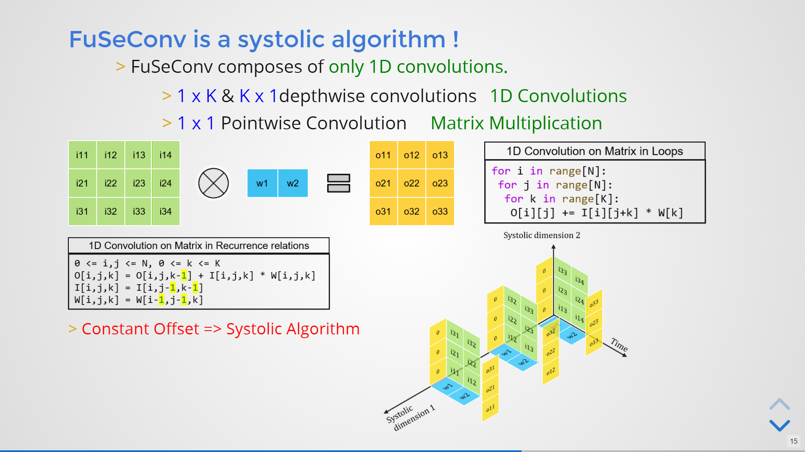

# FuSeConv: Fully Separable Convolutions for Fast Inference on Systolic Arrays  [[Paper](https://surya00060.github.io/files/FuSeConv_DATE_2021.pdf)][[Short Slides](https://slides.com/vinodganesan/fuseconv_date_2021-9d8347/fullscreen?token=twJbUI6C)][[Full Slides](https://slides.com/vinodganesan/fuseconv_date_2021/fullscreen?token=0vfMX47V)][[Video](https://surya00060.github.io/files/FuSeConv_DATE_2021.mp4)]

```BibTex
@INPROCEEDINGS{9473985,  
author={Selvam, Surya and Ganesan, Vinod and Kumar, Pratyush},  
booktitle={2021 Design, Automation   Test in Europe Conference   Exhibition (DATE)},   
title={FuSeConv: Fully Separable Convolutions for Fast Inference on Systolic Arrays},   
year={2021},  volume={},  number={},  pages={651-656},  
doi={10.23919/DATE51398.2021.9473985}
}
```
## Problem: Inefficient Mapping of Depthwise Convolutions onto Systolic Arrays


## Our Proposed Hardware/Software Co-Design Solution: FuSeConv

### Network Modification


### Hardware Modification


## Results

### MobileNet-V1

|           Network          | ImageNet  Accuracy | FLOPS (M) | Params (M) | Speedup |
|:--------------------------:|:------------------:|:---------:|:----------:|:-------:|
|   MobileNet V1 Baseline    |        70.60       |    589    |    4.23    |    1x   |
|   MobileNet V1 Full FuSe   |        72.86       |    1122   |    7.36    |   4.1x  |
|   MobileNet V1 Half FuSe   |        72.00       |    573    |    4.20    |  6.76x  |
| MobileNet V1 50% Full FuSe |        72.42       |    764    |    4.35    |   2.3x  |
| MobileNet V1 50% Half FuSe |        71.77       |    578    |    4.22    |  2.36x  |

### MobileNet-V2

|           Network          | ImageNet  Accuracy | FLOPS (M) | Params (M) | Speedup |
|:--------------------------:|:------------------:|:---------:|:----------:|:-------:|
|   MobileNet V2 Baseline    |        72.00       |    315    |    3.50    |    1x   |
|   MobileNet V2 Full FuSe   |        72.49       |    430    |    4.46    |   5.1x  |
|   MobileNet V2 Half FuSe   |        70.80       |    300    |    3.46    |  7.23x  |
| MobileNet V2 50% Full FuSe |        72.11       |    361    |    3.61    |   2.0x  |
| MobileNet V2 50% Half FuSe |        71.98       |    305    |    3.49    |   2.1x  |

### MNasNet-B1

|          Network         | ImageNet  Accuracy | FLOPS (M) | Params (M) | Speedup |
|:------------------------:|:------------------:|:---------:|:----------:|:-------:|
|   MnasNet B1 Baseline    |        73.50       |    325    |    4.38    |    1x   |
|   MnasNet B1 Full FuSe   |        73.16       |    440    |    5.66    |  5.06x  |
|   MnasNet B1 Half FuSe   |        71.48       |    305    |    4.25    |  7.15x  |
| MnasNet B1 50% Full FuSe |        73.52       |    361    |    4.47    |  1.88x  |
| MnasNet B1 50% Half FuSe |        72.61       |    312    |    4.35    |  1.97x  |

### MobileNet-V3 Small

|              Network             | ImageNet  Accuracy | FLOPS (M) | Params (M) | Speedup |
|:--------------------------------:|:------------------:|:---------:|:----------:|:-------:|
|    MobileNet V3 Small Baseline   |        67.40       |     66    |    2.93    |    1x   |
|   MobileNet V3 Small Full FuSe   |        67.17       |     84    |    4.44    |  3.02x  |
|   MobileNet V3 Small Half FuSe   |        64.55       |     61    |    2.89    |  4.16x  |
| MobileNet V3 Small 50% Full FuSe |        67.91       |     73    |    3.18    |   1.6x  |
| MobileNet V3 Small 50% Half FuSe |        66.90       |     63    |    2.92    |  1.68x  |

### MobileNet-V3 Large

|              Network             | ImageNet  Accuracy | FLOPS (M) | Params (M) | Speedup |
|:--------------------------------:|:------------------:|:---------:|:----------:|:-------:|
|    MobileNet V3 Large Baseline   |        75.20       |    238    |    5.47    |    1x   |
|   MobileNet V3 Large Full FuSe   |        74.40       |    322    |    10.57   |  3.61x  |
|   MobileNet V3 Large Half FuSe   |        73.02       |    225    |    5.40    |  5.45x  |
| MobileNet V3 Large 50% Full FuSe |        74.50       |    264    |    5.57    |  1.76x  |
| MobileNet V3 Large 50% Half FuSe |        73.80       |    230    |    5.46    |  1.83x  |


## PyTorch Model Codes

The code for the following DNNs along with their varaints can be found in ```models``` directory.
* MobileNet V1
* MobileNet V2
* MobileNet V3
* MnasNet-B1
* ResNet

## How to use these model codes to import?
```python
from models import *
num_classes = 1000

baseline = [MnasNet(num_classes), MobileNetV1(num_classes), MobileNetV2(num_classes), MobileNetV3('small', num_classes), MobileNetV3('large', num_classes)]

fuSeHalf = [MnasNetFuSeHalf(num_classes), MobileNetV1FuSeHalf(num_classes), MobileNetV2FuSeHalf(num_classes), MobileNetV3FuSeHalf('small', num_classes), MobileNetV3FuSeHalf('large', num_classes)]

fuSeFull = [MnasNetFuSeFull(num_classes), MobileNetV1FuSeFull(num_classes), MobileNetV2FuSeFull(num_classes), MobileNetV3FuSeFull('small', num_classes), MobileNetV3FuSeFull('large', num_classes)]

fuSeHalfHybrid = [MnasNetFuSeHalfHybrid(num_classes), MobileNetV1FuSeHalfHybrid(num_classes), MobileNetV2FuSeHalfHybrid(num_classes), MobileNetV3FuSeHalfHybrid('small', num_classes), MobileNetV3FuSeHalfHybrid('large', num_classes)]

fuSeFullHybrid = [MnasNetFuSeFullHybrid(num_classes), MobileNetV1FuSeFullHybrid(num_classes), MobileNetV2FuSeFullHybrid(num_classes), MobileNetV3FuSeFullHybrid('small', num_classes), MobileNetV3FuSeFullHybrid('large', num_classes)]
```
## Train on ImageNet

### MobileNets and MnasNet
To train the MobileNets(V2, V3-Small and V3-Large) and MnasNet on ImageNet dataset, we reused the code from following [repository](https://github.com/meijieru/yet_another_mobilenet_series). Thanks to those authors for setting up a perfect environment to train ImageNet models. Please refer the above repo for more details. Modified Code to train FuSeNetworks can be found in ```yet_another_mobilenet_series/```.

The training hyperparameters used are listed below.

|   Hyperparameter   |   Value   |    Hyperparameter    |  Value  |
|:------------------:|:---------:|:--------------------:|:-------:|
|  Image Resolution  | 224 x 224 |     lr scheduler     | rmsprop |
|       epochs       |    350    |    lr decay gamma    |   0.97  |
|      optimizer     |  rmsprop  |    lr decay epoch    |   2.4   |
|      momentum      |    0.9    |    label smoothing   |   0.1   |
|        alpha       |    0.9    | moving avearge decay |  0.9999 |
|       epsilon      |   0.001   |      random seed     |   1995  |
|    weight decay    |    1e-5   |  batch_norm momentum |   0.01  |
|       base lr      |   0.016   |  batch_norm epsilon  |  1e-03  |
| batch size per GPU |    128    |                      |         |

### MobileNet-V1 and ResNet
To train ResNet and MobileNet-V1 on ImageNet dataset, we reused the code from following [repository](https://github.com/cybertronai/imagenet18). This repo enabled us to train ResNet-50 and MobileNet-V1 in 30-40 epochs compared 350 epochs of MobileNets. A blog post by the authors on various techniques used to train ImageNet in 18 minutes can be found [here](https://www.fast.ai/2018/08/10/fastai-diu-imagenet/). Modified Code to train FuSeNetworks can be found in ```localTrain/```.

## Train on CIFAR

CIFAR images 32x32 are resized or upscaled to 224x224 and used to train the models.  

```
python traincifar224.py -D Dataset -N Network -n NameoftheRun -v Variant

--resume : For Resuming the Run

Options: 
Dataset = CIFAR10, CIFAR100  
Network = ResNet, MobileNetV1, MobileNetV2, MobileNetV3S, MobileNetV3L, MnasNet 
Variant = baseline, half, full
```

## Analytical model to compute inference latency on systolic arrays and modified hardware

```python
from models import *
from analyticalLatencyModel import getModelLatency

# Set Input tensor Dimension and Systolic Array Dimension 
x = torch.rand([1,3,224,224])
arrX = 64
arrY = 64

# Some Baseline non FuSeNetwork
net = X() 
hardware = 'Systolic'
latency = getModelLatency(net, x, arrX, arrY, hardware)

# FuSeVariants
net = XFuSeY() 
hardware = 'FuSe'
latency = getModelLatency(net, x, arrX, arrY, hardware)

## Hardware = FuSe performs optimal mapping for FuSe layers.  
```

There's also a sample code in ```analyticalLatencyModel.py```.
```
python analyticalLatencyModel.py
```

## Short Slides
[](https://slides.com/vinodganesan/fuseconv_date_2021-9d8347/fullscreen?token=twJbUI6C)

## Full Slides
[](https://slides.com/vinodganesan/fuseconv_date_2021/fullscreen?token=0vfMX47V)

## Video
[](https://surya00060.github.io/files/FuSeConv_DATE_2021.mp4)
